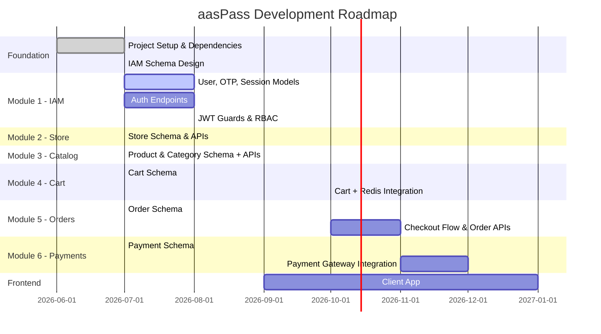

# 01 — Project Overview

> [← Back to Index](../README.md)

---

## What is aasPass?

**aasPass** is a full-stack, modular **multi-vendor marketplace / e-commerce platform**. It enables multiple stores to register and operate independently within a single unified platform — handling everything from product listings and cart sessions to order processing and payment collection.

---

## Design Goals

| Goal | How It's Achieved |
|---|---|
| **Modularity** | Each business domain is an isolated NestJS module + Prisma schema module |
| **Scalability** | Redis + BullMQ for async jobs; stateless JWT auth |
| **Real-time** | Socket.io WebSockets for live order updates & notifications |
| **Security-first** | JWT, Helmet, Rate Limiting, bcrypt, RBAC |
| **Developer Experience** | Strict TypeScript, Prettier, ESLint, hot-reload dev server |

---

## Technology Stack

### Backend

| Category | Technology | Version |
|---|---|---|
| **Runtime** | Node.js | LTS |
| **Language** | TypeScript | ^5.7.3 |
| **Framework** | NestJS | ^11.0.1 |
| **ORM** | Prisma | ^7.8.0 |
| **Database** | PostgreSQL | Local (5432) |
| **Auth** | JWT + Passport.js | @nestjs/jwt ^11.0.2 |
| **Password Hashing** | bcrypt | ^6.0.0 |
| **Cache / Sessions** | ioredis (Redis) | ^5.11.1 |
| **Job Queues** | BullMQ | ^5.79.2 |
| **WebSockets** | Socket.io | ^4.8.3 |
| **API Docs** | Swagger / OpenAPI | @nestjs/swagger ^11.4.5 |
| **HTTP Security** | Helmet | ^8.2.0 |
| **Rate Limiting** | @nestjs/throttler | ^6.5.0 |
| **Compression** | compression | ^1.8.1 |
| **Cookies** | cookie-parser | ^1.4.7 |
| **Logging** | nestjs-pino + pino-pretty | ^4.6.1 |
| **Validation** | class-validator + class-transformer | ^0.15.1 |
| **Unique IDs** | uuid | ^14.0.1 |

### Frontend

> 🔧 **Status:** Directory exists — implementation not yet started.

---

## Module Overview

| # | Module | Responsibility | Status |
|---|---|---|---|
| 1 | **IAM** | Users, roles, permissions, auth, sessions | 🟡 Schema Done |
| 2 | **Store** | Vendor onboarding, store profiles | 🟡 Schema Done |
| 3 | **Catalog** | Products, categories, variants, inventory | 🟡 Schema Done |
| 4 | **Cart** | Cart per store, wishlist, price snapshots | 🟡 Schema Done |
| 5 | **Orders** | Checkout, order lifecycle, replacements | 🟡 Schema Done |
| 6 | **Payments** | Gateway integration, refunds, webhooks | 🟡 Schema Done |

---

## Roadmap

