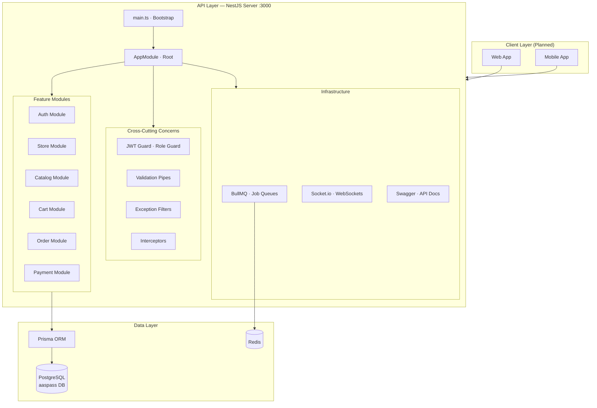

# 03 — Architecture

> [← Back to Index](../README.md)

---

## System Architecture



---

## Request Lifecycle

Every HTTP request passes through this pipeline before reaching a controller:

```
Incoming HTTP Request
        │
        ▼
┌─────────────────────┐
│  Helmet             │  ← Security headers (XSS, CSRF, etc.)
└─────────────────────┘
        │
        ▼
┌─────────────────────┐
│  Rate Limiter       │  ← Throttle abuse (e.g. 100 req/min)
└─────────────────────┘
        │
        ▼
┌─────────────────────┐
│  Cookie Parser      │  ← Parse HTTP-only cookies
└─────────────────────┘
        │
        ▼
┌─────────────────────┐
│  Compression        │  ← gzip response body
└─────────────────────┘
        │
        ▼
┌─────────────────────┐
│  NestJS Router      │  ← Match route to controller
└─────────────────────┘
        │
        ▼
┌─────────────────────┐
│  JWT Guard          │  ← Verify access token
└─────────────────────┘
        │
        ▼
┌─────────────────────┐
│  Role Guard         │  ← Check user role/permissions (RBAC)
└─────────────────────┘
        │
        ▼
┌─────────────────────┐
│  Validation Pipe    │  ← class-validator DTO validation
└─────────────────────┘
        │
        ▼
┌─────────────────────┐
│  Controller         │  ← Handle request, call service
└─────────────────────┘
        │
        ▼
┌─────────────────────┐
│  Service            │  ← Business logic
└─────────────────────┘
        │
        ▼
┌─────────────────────┐
│  Prisma             │  ← Database query
└─────────────────────┘
        │
        ▼
┌─────────────────────┐
│  Response Interceptor│  ← Transform / wrap response
└─────────────────────┘
        │
        ▼
   HTTP Response
```

---

## Infrastructure Dependencies

### PostgreSQL
- **Role:** Primary relational database
- **Connection:** `localhost:5432`
- **Database:** `aaspass`
- **Schema:** `public`
- **Access:** Via Prisma ORM

### Redis
- **Role:** Cache store + BullMQ backend
- **Connection:** `localhost:6379` (default)
- **Used for:**
  - Background job queues (BullMQ)
  - Guest cart session storage (planned)
  - Token revocation cache (optional — primary revocation is DB-based via `RefreshToken.revokedAt`)

### BullMQ (Job Queues)

Decouples heavy operations from the request cycle:

| Queue | Purpose |
|---|---|
| `email-queue` | Send OTPs, order confirmations, receipts |
| `notification-queue` | Push notifications, in-app alerts |
| `payment-queue` | Async payment gateway calls |

### Socket.io (WebSockets)

Real-time communication layer:

| Event (Planned) | Direction | Purpose |
|---|---|---|
| `order:status-update` | Server → Client | Notify buyer of order progress |
| `notification:new` | Server → Client | Push new alerts to user |
| `store:order-received` | Server → Vendor | Alert store of new order |

---

## Naming Conventions

| Item | Convention | Example |
|---|---|---|
| Database tables | `snake_case` (via `@@map`) | `role_permissions` |
| Database columns | `snake_case` (via `@map`) | `created_by`, `is_active` |
| Database enum types | `snake_case` (via `@@map`) | `user_status`, `order_status` |
| Prisma model names | `PascalCase` | `RolePermission` |
| Field names | `camelCase` | `createdBy`, `isActive` |
| Enum names | `PascalCase` | `UserStatus` |
| Enum values | `UPPER_SNAKE_CASE` | `PENDING_VERIFICATION` |
| NestJS files | `kebab-case.type.ts` | `auth.service.ts` |
| NestJS modules | `PascalCase` | `AuthModule` |
| Primary keys | UUID v4 auto-generated | `@id @default(uuid()) @db.Uuid` |

---

## Database Conventions

- All tables have `createdAt` / `updatedAt` timestamp fields
- All tables have optional `createdBy` / `updatedBy` UUID fields for audit trails
- **Soft-delete** preferred (via `isActive` flag or `deletedAt` field)
- Cascade deletes used **only** on join/bridge tables
- All foreign keys are explicitly indexed
