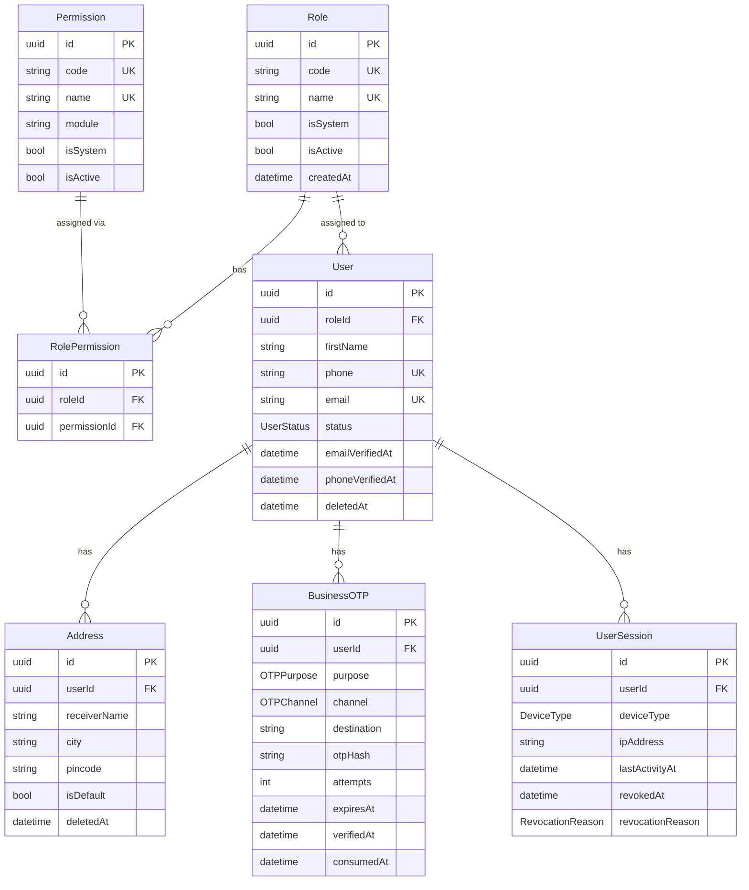

# Database — Module 1: Identity & Access Management (IAM)

> [← Back to Index](../README.md)
> **Schema file:** [`server/prisma/modules/module1.auth.prisma`](../../server/prisma/modules/module1.auth.prisma)
> **Status:** Schema Complete
> **Last Updated:** 2026-07-28

---

## Overview

The IAM module handles all concerns related to:
- User account management & profile data
- Address book management
- Role-Based Access Control (RBAC)
- Business-context OTP (delivery, pickup, recovery)
- Device session tracking

> **Auth is handled by Supabase.** Supabase manages registration, OTP login, JWT issuance, and email/phone verification. The `users` table in this module mirrors the Supabase Auth user via the same UUID primary key — the PK is **not** auto-generated here.

---

## Enums

> All enums are mapped to snake_case PostgreSQL enum types via `@@map`.

### `UserStatus` → `user_status`
Tracks the lifecycle state of a user account.

| Value | Description |
|---|---|
| `ACTIVE` | Account is active and fully operational |
| `INACTIVE` | Account has been deactivated |
| `BLOCKED` | Account has been blocked (e.g., by admin) |
| `PENDING_VERIFICATION` | Registration complete but email/phone not yet verified |

---

### `OTPPurpose` → `otp_purpose`
Describes why a business OTP was generated.

| Value | Description |
|---|---|
| `ORDER_DELIVERY` | OTP to confirm delivery at the customer's doorstep |
| `ORDER_PICKUP` | OTP to confirm customer pickup from store |
| `ACCOUNT_RECOVERY` | Secondary account recovery flow (supplements Supabase) |
| `SENSITIVE_ACTION` | High-security actions (e.g., deletion, withdrawal) |

---

### `OTPChannel` → `otp_channel`
Delivery method for the OTP.

| Value | Description |
|---|---|
| `SMS` | Delivered via SMS to phone number |
| `EMAIL` | Delivered via email |

---

### `BusinessOTPReferenceType` → `business_otp_reference_type`
The kind of business entity a BusinessOTP is protecting.

| Value | Description |
|---|---|
| `ORDER` | OTP is linked to an order entity |
| `ACCOUNT` | OTP is linked to the user account itself |

> `referenceType` is nullable on `BusinessOTP` because `ACCOUNT_RECOVERY` has no business entity — only a user.

---

### `DeviceType` → `device_type`
Client device classification for session tracking.

| Value | Description |
|---|---|
| `MOBILE` | Mobile phone |
| `TABLET` | Tablet device |
| `DESKTOP` | Desktop/laptop application |
| `WEB` | Browser-based web app |

---

### `RevocationReason` → `revocation_reason`
Why a session was invalidated.

| Value | Description |
|---|---|
| `LOGOUT` | User explicitly logged out |
| `PASSWORD_CHANGED` | Security: password was updated |
| `TOKEN_ROTATED` | Old token replaced during refresh rotation |
| `ACCOUNT_LOCKED` | Account was locked by admin |
| `SECURITY` | Suspicious activity detected |
| `EXPIRED` | Session naturally expired |

---

## Models

> All models map to snake_case PostgreSQL table names via `@@map`. All camelCase fields map to snake_case column names via `@map`.

### `Role` → `roles` table

Represents a named role assigned to users. Roles are linked to permissions.

| Field | DB Column | Type | Constraint | Description |
|---|---|---|---|---|
| `id` | `id` | UUID | PK, auto | Primary key |
| `code` | `code` | VarChar(50) | Unique | Machine-readable ID (e.g. `SUPER_ADMIN`) |
| `name` | `name` | VarChar(100) | Unique | Display name (e.g. `Super Admin`) |
| `description` | `description` | VarChar(255)? | Optional | What this role can do |
| `isSystem` | `is_system` | Boolean | Default: `false` | System roles cannot be deleted |
| `isActive` | `is_active` | Boolean | Default: `true` | Soft-disable a role |
| `createdBy` | `created_by` | UUID? | Optional | Audit: who created it |
| `updatedBy` | `updated_by` | UUID? | Optional | Audit: who last updated it |
| `createdAt` | `created_at` | DateTime | Auto: `now()` | Timestamp |
| `updatedAt` | `updated_at` | DateTime | Auto-updated | Timestamp |

**Indexes:** `@@index([isActive])`
**Relations:** `users → User[]`, `rolePermissions → RolePermission[]`

---

### `Permission` → `permissions` table

A granular action that can be granted to a role (e.g. `catalog:product:create`).

| Field | DB Column | Type | Constraint | Description |
|---|---|---|---|---|
| `id` | `id` | UUID | PK, auto | Primary key |
| `code` | `code` | VarChar(100) | Unique | Action code (e.g. `store:read`) |
| `name` | `name` | VarChar(100) | Unique | Human-readable name |
| `module` | `module` | VarChar(100) | Indexed | Which module this belongs to |
| `description` | `description` | VarChar(255)? | Optional | What this permission allows |
| `isSystem` | `is_system` | Boolean | Default: `false` | System permissions cannot be deleted |
| `isActive` | `is_active` | Boolean | Default: `true` | Soft-disable |
| `createdBy` | `created_by` | UUID? | Optional | Audit trail |
| `updatedBy` | `updated_by` | UUID? | Optional | Audit trail |
| `createdAt` | `created_at` | DateTime | Auto: `now()` | Timestamp |
| `updatedAt` | `updated_at` | DateTime | Auto-updated | Timestamp |

**Indexes:** `@@index([module])`, `@@index([isActive])`
**Relations:** `rolePermissions → RolePermission[]`

---

### `RolePermission` → `role_permissions` table

Bridge table connecting roles to permissions (many-to-many).

| Field | DB Column | Type | Constraint | Description |
|---|---|---|---|---|
| `id` | `id` | UUID | PK, auto | Primary key |
| `roleId` | `role_id` | UUID | FK → `roles.id`, Cascade | The role |
| `permissionId` | `permission_id` | UUID | FK → `permissions.id`, Cascade | The permission |
| `createdBy` | `created_by` | UUID? | Optional | Audit trail |
| `updatedBy` | `updated_by` | UUID? | Optional | Audit trail |
| `createdAt` | `created_at` | DateTime | Auto: `now()` | Timestamp |
| `updatedAt` | `updated_at` | DateTime | Auto-updated | Timestamp |

**Constraints:** `@@unique([roleId, permissionId])`
**Indexes:** `@@index([roleId])`, `@@index([permissionId])`

---

### `User` → `users` table

Core user account record. The `id` is **not** auto-generated — it is set from Supabase Auth's user UUID at registration time.

| Field | DB Column | Type | Constraint | Description |
|---|---|---|---|---|
| `id` | `id` | UUID | PK (**no auto-generate**) | Supabase Auth user UUID |
| `roleId` | `role_id` | UUID | FK → `roles.id`, Restrict, Indexed | Assigned role |
| `firstName` | `first_name` | VarChar(100) | Required | First name |
| `lastName` | `last_name` | VarChar(100)? | Optional | Last name |
| `phone` | `phone` | VarChar(15)? | Unique, Indexed | Mobile phone number |
| `email` | `email` | VarChar(255)? | Unique, Indexed | Email address |
| `status` | `status` | `UserStatus` | Default: `PENDING_VERIFICATION`, Indexed | Account lifecycle state |
| `emailVerifiedAt` | `email_verified_at` | DateTime? | Optional | When email was verified (synced from Supabase) |
| `phoneVerifiedAt` | `phone_verified_at` | DateTime? | Optional | When phone was verified (synced from Supabase) |
| `lastSeenAt` | `last_seen_at` | DateTime? | Optional | Last activity timestamp |
| `createdBy` | `created_by` | UUID? | Optional | Audit trail |
| `updatedBy` | `updated_by` | UUID? | Optional | Audit trail |
| `createdAt` | `created_at` | DateTime | Auto: `now()` | Timestamp |
| `updatedAt` | `updated_at` | DateTime | Auto-updated | Timestamp |
| `deletedAt` | `deleted_at` | DateTime? | Optional | Soft-delete timestamp |

**Constraints:** `@@unique([phone])`, `@@unique([email])`
**Indexes:** `@@index([roleId])`, `@@index([status])`, `@@index([phone])`, `@@index([email])`
**Relations:** `role`, `addresses[]`, `businessOtps[]`, `sessions[]`, `ownedStore`, `verifiedStores[]`, `carts[]`, `wishlists[]`, `orders[]`

> **Design Note:** Authentication (password, OAuth, OTP login) is delegated to Supabase Auth. This table stores only application-layer user data — profile, role, and status. Removed from earlier schema: `passwordHash`, `failedLoginAttempts`, `lockedUntil`, `lastLoginAt`, `lastLoginIp`, `passwordChangedAt`.

---

### `Address` → `addresses` table

User's saved delivery addresses with geolocation support.

| Field | DB Column | Type | Constraint | Description |
|---|---|---|---|---|
| `id` | `id` | UUID | PK, auto | Primary key |
| `userId` | `user_id` | UUID | FK → `users.id`, Cascade, Indexed | Owner of this address |
| `label` | `label` | VarChar(50)? | Optional | e.g. "Home", "Office" |
| `receiverName` | `receiver_name` | VarChar(100) | Required | Name of person receiving delivery |
| `receiverPhone` | `receiver_phone` | VarChar(15) | Required | Contact number for delivery |
| `houseNo` | `house_no` | VarChar(100) | Required | House/flat/building number |
| `street` | `street` | VarChar(255)? | Optional | Street name |
| `area` | `area` | VarChar(255) | Required | Locality/area |
| `landmark` | `landmark` | VarChar(255)? | Optional | Nearby landmark |
| `city` | `city` | VarChar(100) | Required, Indexed | City name |
| `state` | `state` | VarChar(100) | Required | State name |
| `country` | `country` | VarChar(100) | Required | Country name |
| `pincode` | `pincode` | VarChar(10) | Required, Indexed | Postal/ZIP code |
| `latitude` | `latitude` | Decimal(10,8)? | Optional | GPS latitude |
| `longitude` | `longitude` | Decimal(11,8)? | Optional | GPS longitude |
| `isDefault` | `is_default` | Boolean | Default: `false` | User's primary address flag |
| `createdBy` | `created_by` | UUID? | Optional | Audit trail |
| `updatedBy` | `updated_by` | UUID? | Optional | Audit trail |
| `createdAt` | `created_at` | DateTime | Auto: `now()` | Timestamp |
| `updatedAt` | `updated_at` | DateTime | Auto-updated | Timestamp |
| `deletedAt` | `deleted_at` | DateTime? | Optional | Soft-delete timestamp |

**Indexes:** `@@index([userId])`, `@@index([userId, isDefault])`, `@@index([city])`, `@@index([pincode])`

---

### `BusinessOTP` → `business_otps` table

Stores OTP records for **business-context** flows — delivery confirmation, pickup confirmation, account recovery, and sensitive actions. This is **separate** from Supabase Auth's OTP (which handles login/registration).

| Field | DB Column | Type | Constraint | Description |
|---|---|---|---|---|
| `id` | `id` | UUID | PK, auto | Primary key |
| `userId` | `user_id` | UUID? | FK → `users.id`, Cascade, Indexed | Associated user (`null` allowed for pre-auth flows) |
| `referenceType` | `reference_type` | `BusinessOTPReferenceType`? | Optional | Polymorphic entity type (`ORDER`, `ACCOUNT`) |
| `referenceId` | `reference_id` | UUID? | Optional | Polymorphic entity ID |
| `purpose` | `purpose` | `OTPPurpose` | Required, Indexed | Why OTP was generated |
| `channel` | `channel` | `OTPChannel` | Required, Indexed | SMS or EMAIL |
| `destination` | `destination` | VarChar(255) | Required, Indexed | Phone number or email address |
| `otpHash` | `otp_hash` | VarChar(255) | Required | Bcrypt hash of the OTP (never stored plaintext) |
| `attempts` | `attempts` | Int | Default: `0` | How many times user has tried |
| `maxAttempts` | `max_attempts` | Int | Default: `5` | Max allowed attempts before block |
| `lastAttemptAt` | `last_attempt_at` | DateTime? | Optional | Timestamp of last verification attempt |
| `blockedUntil` | `blocked_until` | DateTime? | Optional | Brute-force block expiry |
| `expiresAt` | `expires_at` | DateTime | Required, Indexed | OTP expiry timestamp |
| `verifiedAt` | `verified_at` | DateTime? | Optional | Timestamp of successful verification |
| `consumedAt` | `consumed_at` | DateTime? | Optional | When OTP was consumed (action completed) |
| `createdBy` | `created_by` | UUID? | Optional | Audit trail |
| `updatedBy` | `updated_by` | UUID? | Optional | Audit trail |
| `createdAt` | `created_at` | DateTime | Auto: `now()` | Timestamp |
| `updatedAt` | `updated_at` | DateTime | Auto-updated | Timestamp |

**Indexes:** `@@index([userId])`, `@@index([referenceType, referenceId])`, `@@index([purpose])`, `@@index([channel])`, `@@index([destination])`, `@@index([expiresAt])`

> **Design Note:** `referenceType` and `referenceId` are nullable because `ACCOUNT_RECOVERY` purpose has no associated business entity — only a user. `consumedAt` distinguishes a verified OTP that has been acted upon from one that was merely verified.

---

### `UserSession` → `user_sessions` table

Records each device login session. Provides audit trail and supports session revocation.

| Field | DB Column | Type | Constraint | Description |
|---|---|---|---|---|
| `id` | `id` | UUID | PK, auto | Primary key |
| `userId` | `user_id` | UUID | FK → `users.id`, Cascade, Indexed | The user this session belongs to |
| `deviceType` | `device_type` | `DeviceType` | Required | Type of device used |
| `deviceName` | `device_name` | VarChar(255)? | Optional | e.g. "iPhone 15 Pro" |
| `deviceId` | `device_id` | VarChar(255)? | Optional | Device fingerprint identifier |
| `ipAddress` | `ip_address` | VarChar(45)? | Optional | IP at time of login (IPv4/IPv6) |
| `userAgent` | `user_agent` | Text? | Optional | Full browser/app user-agent string |
| `lastActivityAt` | `last_activity_at` | DateTime | Default: `now()`, Indexed | Last request in this session |
| `revokedAt` | `revoked_at` | DateTime? | Optional, Indexed | Set when session is ended |
| `revocationReason` | `revocation_reason` | `RevocationReason`? | Optional | Why session was revoked |
| `createdBy` | `created_by` | UUID? | Optional | Audit trail |
| `updatedBy` | `updated_by` | UUID? | Optional | Audit trail |
| `createdAt` | `created_at` | DateTime | Auto: `now()` | Timestamp |
| `updatedAt` | `updated_at` | DateTime | Auto-updated | Timestamp |

**Indexes:** `@@index([userId])`, `@@index([userId, deviceId])`, `@@index([lastActivityAt])`, `@@index([revokedAt])`

> **Design Note:** `expiresAt` has been removed — session lifetime is managed by Supabase JWT expiry. `revocationReason` replaces the old `RevocationReason` from `RefreshToken`. The old `RefreshToken` model has been removed entirely as token management is now delegated to Supabase.

---

## Removed Models (vs. Previous Versions)

The following models existed in earlier schema iterations but have been **removed** after migrating authentication to Supabase:

| Removed Model | Old Table | Reason |
|---|---|---|
| `OTPVerification` | `otp_verifications` | Replaced by `BusinessOTP` for business flows; auth OTPs handled by Supabase |
| `UserAuthProvider` | `user_auth_providers` | OAuth provider links managed by Supabase Auth |
| `RefreshToken` | `refresh_tokens` | Refresh token lifecycle managed by Supabase |

---

## Entity Relationship Diagram

---

## Model Summary Table

| Model | Table | Records Represent |
|---|---|---|
| `Role` | `roles` | Named permission groups |
| `Permission` | `permissions` | Granular action codes |
| `RolePermission` | `role_permissions` | Role ↔ Permission mapping |
| `User` | `users` | User accounts (profile + role + status) |
| `Address` | `addresses` | User delivery addresses |
| `BusinessOTP` | `business_otps` | Business-context OTPs (delivery, pickup, recovery) |
| `UserSession` | `user_sessions` | Login sessions per device |
