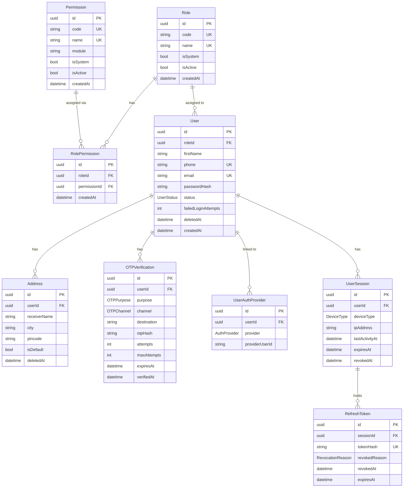

# Database — Module 1: Identity & Access Management (IAM)

> [← Back to Index](../README.md)  
> **Schema file:** [`server/prisma/schema.prisma`](../../server/prisma/schema.prisma) & [`server/prisma/modules/module1.auth.prisma`](../../server/prisma/modules/module1.auth.prisma)  
> **Status:** ✅ Schema Complete

---

## Overview

The IAM module handles all concerns related to:
- User account management & profile data
- Address book management
- Authentication (local email/phone + Google OAuth)
- OTP (One-Time Password) generation and verification
- JWT session and refresh token lifecycle
- Role-Based Access Control (RBAC)

---

## Enums

> All enums are mapped to snake_case PostgreSQL enum types via `@@map`.

### `UserStatus` → `user_status`
Tracks the lifecycle state of a user account.

| Value | Description |
|---|---|
| `ACTIVE` | Account is active and fully operational |
| `INACTIVE` | Account has been deactivated |
| `BLOCKED` | Account has been blocked (e.g., by admin) |
| `PENDING_VERIFICATION` | Registration complete but email/phone not yet verified |

---

### `OTPPurpose` → `otp_purpose`
Describes why an OTP was generated.

| Value | Description |
|---|---|
| `REGISTRATION` | First-time account registration |
| `LOGIN` | OTP-based login (passwordless) |
| `PASSWORD_RESET` | User requested a password reset |
| `PHONE_VERIFICATION` | Verifying a phone number |
| `EMAIL_VERIFICATION` | Verifying an email address |

---

### `OTPChannel` → `otp_channel`
Delivery method for the OTP.

| Value | Description |
|---|---|
| `SMS` | Delivered via SMS to phone number |
| `EMAIL` | Delivered via email |

---

### `AuthProvider` → `auth_provider`
Which authentication strategy the user used.

| Value | Description |
|---|---|
| `LOCAL` | Email/phone + password (traditional) |
| `GOOGLE` | OAuth 2.0 via Google |

---

### `DeviceType` → `device_type`
Client device classification for session tracking.

| Value | Description |
|---|---|
| `MOBILE` | Mobile phone |
| `TABLET` | Tablet device |
| `DESKTOP` | Desktop/laptop application |
| `WEB` | Browser-based web app |

---

### `RevocationReason` → `revocation_reason`
Why a refresh token was invalidated.

| Value | Description |
|---|---|
| `LOGOUT` | User explicitly logged out |
| `PASSWORD_CHANGED` | Security: password was updated |
| `TOKEN_ROTATED` | Old token replaced during refresh rotation |
| `ACCOUNT_LOCKED` | Account was locked by admin |
| `SECURITY` | Suspicious activity detected |
| `EXPIRED` | Token naturally expired |

---

## Models

> All models map to snake_case PostgreSQL table names via `@@map`. All camelCase fields map to snake_case column names via `@map`.

### `Role` → `roles` table

Represents a named role assigned to users. Roles are linked to permissions.

| Field | DB Column | Type | Constraint | Description |
|---|---|---|---|---|
| `id` | `id` | UUID | PK, auto | Primary key |
| `code` | `code` | VarChar(50) | Unique | Machine-readable ID (e.g. `SUPER_ADMIN`) |
| `name` | `name` | VarChar(100) | Unique | Display name (e.g. `Super Admin`) |
| `description` | `description` | VarChar(255)? | Optional | What this role can do |
| `isSystem` | `is_system` | Boolean | Default: `false` | System roles cannot be deleted |
| `isActive` | `is_active` | Boolean | Default: `true` | Soft-disable a role |
| `createdBy` | `created_by` | UUID? | Optional | Audit: who created it |
| `updatedBy` | `updated_by` | UUID? | Optional | Audit: who last updated it |
| `createdAt` | `created_at` | DateTime | Auto: `now()` | Timestamp |
| `updatedAt` | `updated_at` | DateTime | Auto-updated | Timestamp |

**Indexes:** `@@index([isActive])`  
**Relations:** `users → User[]`, `rolePermissions → RolePermission[]`

---

### `Permission` → `permissions` table

A granular action that can be granted to a role (e.g. `catalog:product:create`).

| Field | DB Column | Type | Constraint | Description |
|---|---|---|---|---|
| `id` | `id` | UUID | PK, auto | Primary key |
| `code` | `code` | VarChar(100) | Unique | Action code (e.g. `store:read`) |
| `name` | `name` | VarChar(100) | Unique | Human-readable name |
| `module` | `module` | VarChar(100) | Indexed | Which module this belongs to |
| `description` | `description` | VarChar(255)? | Optional | What this permission allows |
| `isSystem` | `is_system` | Boolean | Default: `false` | System permissions cannot be deleted |
| `isActive` | `is_active` | Boolean | Default: `true` | Soft-disable |
| `createdBy` | `created_by` | UUID? | Optional | Audit trail |
| `updatedBy` | `updated_by` | UUID? | Optional | Audit trail |
| `createdAt` | `created_at` | DateTime | Auto: `now()` | Timestamp |
| `updatedAt` | `updated_at` | DateTime | Auto-updated | Timestamp |

**Indexes:** `@@index([module])`, `@@index([isActive])`  
**Relations:** `rolePermissions → RolePermission[]`

---

### `RolePermission` → `role_permissions` table

Bridge table connecting roles to permissions (many-to-many).

| Field | DB Column | Type | Constraint | Description |
|---|---|---|---|---|
| `id` | `id` | UUID | PK, auto | Primary key |
| `roleId` | `role_id` | UUID | FK → `roles.id`, Cascade | The role |
| `permissionId` | `permission_id` | UUID | FK → `permissions.id`, Cascade | The permission |
| `createdBy` | `created_by` | UUID? | Optional | Audit trail |
| `updatedBy` | `updated_by` | UUID? | Optional | Audit trail |
| `createdAt` | `created_at` | DateTime | Auto: `now()` | Timestamp |
| `updatedAt` | `updated_at` | DateTime | Auto-updated | Timestamp |

**Constraints:** `@@unique([roleId, permissionId])`  
**Indexes:** `@@index([roleId])`, `@@index([permissionId])`

---

### `User` → `users` table

Core user account record. The central entity of the IAM module.

| Field | DB Column | Type | Constraint | Description |
|---|---|---|---|---|
| `id` | `id` | UUID | PK, auto | Primary key |
| `roleId` | `role_id` | UUID | FK → `roles.id`, Restrict | Assigned role |
| `firstName` | `first_name` | VarChar(100) | Required | First name |
| `lastName` | `last_name` | VarChar(100)? | Optional | Last name |
| `phone` | `phone` | VarChar(15) | Unique, Indexed | Primary identifier (phone-first) |
| `email` | `email` | VarChar(255)? | Unique, Indexed | Email address (optional) |
| `passwordHash` | `password_hash` | VarChar(255) | Required | bcrypt hashed password |
| `status` | `status` | `UserStatus` | Default: `PENDING_VERIFICATION` | Account lifecycle state |
| `emailVerifiedAt` | `email_verified_at` | DateTime? | Optional | Timestamp of email verification |
| `phoneVerifiedAt` | `phone_verified_at` | DateTime? | Optional | Timestamp of phone verification |
| `passwordChangedAt` | `password_changed_at` | DateTime? | Optional | Last password change timestamp |
| `failedLoginAttempts` | `failed_login_attempts` | Int | Default: `0` | Brute-force protection counter |
| `lockedUntil` | `locked_until` | DateTime? | Optional | Account lock expiry |
| `lastLoginAt` | `last_login_at` | DateTime? | Optional | Last successful login timestamp |
| `lastLoginIp` | `last_login_ip` | VarChar(45)? | Optional | IP of last login (IPv4/IPv6) |
| `lastSeenAt` | `last_seen_at` | DateTime? | Optional | Last activity timestamp |
| `createdBy` | `created_by` | UUID? | Optional | Audit trail |
| `updatedBy` | `updated_by` | UUID? | Optional | Audit trail |
| `createdAt` | `created_at` | DateTime | Auto: `now()` | Timestamp |
| `updatedAt` | `updated_at` | DateTime | Auto-updated | Timestamp |
| `deletedAt` | `deleted_at` | DateTime? | Optional | Soft-delete timestamp |

**Constraints:** `@@unique([phone])`, `@@unique([email])`  
**Indexes:** `@@index([roleId])`, `@@index([status])`, `@@index([phone])`, `@@index([email])`  
**Relations:** `role`, `addresses[]`, `otpVerifications[]`, `authProviders[]`, `sessions[]`

> **Design Note:** Phone is the primary unique identifier. Email is optional, supporting phone-first registration flows.

---

### `Address` → `addresses` table

User's saved delivery/billing addresses with geolocation support.

| Field | DB Column | Type | Constraint | Description |
|---|---|---|---|---|
| `id` | `id` | UUID | PK, auto | Primary key |
| `userId` | `user_id` | UUID | FK → `users.id`, Cascade | Owner of this address |
| `label` | `label` | VarChar(50)? | Optional | e.g. "Home", "Office" |
| `receiverName` | `receiver_name` | VarChar(100) | Required | Name of person receiving delivery |
| `receiverPhone` | `receiver_phone` | VarChar(15) | Required | Contact number for delivery |
| `houseNo` | `house_no` | VarChar(100) | Required | House/flat/building number |
| `street` | `street` | VarChar(255)? | Optional | Street name |
| `area` | `area` | VarChar(255) | Required | Locality/area |
| `landmark` | `landmark` | VarChar(255)? | Optional | Nearby landmark |
| `city` | `city` | VarChar(100) | Required, Indexed | City name |
| `state` | `state` | VarChar(100) | Required | State name |
| `country` | `country` | VarChar(100) | Required | Country name |
| `pincode` | `pincode` | VarChar(10) | Required, Indexed | Postal/ZIP code |
| `latitude` | `latitude` | Decimal(10,8)? | Optional | GPS latitude |
| `longitude` | `longitude` | Decimal(11,8)? | Optional | GPS longitude |
| `isDefault` | `is_default` | Boolean | Default: `false` | User's primary address flag |
| `createdBy` | `created_by` | UUID? | Optional | Audit trail |
| `updatedBy` | `updated_by` | UUID? | Optional | Audit trail |
| `createdAt` | `created_at` | DateTime | Auto: `now()` | Timestamp |
| `updatedAt` | `updated_at` | DateTime | Auto-updated | Timestamp |
| `deletedAt` | `deleted_at` | DateTime? | Optional | Soft-delete timestamp |

**Indexes:** `@@index([userId])`, `@@index([city])`, `@@index([pincode])`

---

### `OTPVerification` → `otp_verifications` table

Stores OTP records for all verification flows. Works for both guests (pre-registration) and authenticated users.

| Field | DB Column | Type | Constraint | Description |
|---|---|---|---|---|
| `id` | `id` | UUID | PK, auto | Primary key |
| `userId` | `user_id` | UUID? | FK → `users.id`, Optional, Cascade | `null` for pre-registration OTPs |
| `purpose` | `purpose` | `OTPPurpose` | Required, Indexed | Why this OTP was generated |
| `channel` | `channel` | `OTPChannel` | Required, Indexed | SMS or EMAIL |
| `destination` | `destination` | VarChar(255) | Required, Indexed | Phone number or email address |
| `otpHash` | `otp_hash` | VarChar(255) | Required | bcrypt hash of the OTP code |
| `attempts` | `attempts` | Int | Default: `0` | How many times user has tried |
| `maxAttempts` | `max_attempts` | Int | Default: `5` | Max allowed attempts before block |
| `lastAttemptAt` | `last_attempt_at` | DateTime? | Optional | Timestamp of last verification attempt |
| `blockedUntil` | `blocked_until` | DateTime? | Optional | Temporary block expiry after max attempts |
| `expiresAt` | `expires_at` | DateTime | Required, Indexed | When this OTP becomes invalid |
| `verifiedAt` | `verified_at` | DateTime? | Optional | Timestamp of successful verification |
| `createdBy` | `created_by` | UUID? | Optional | Audit trail |
| `updatedBy` | `updated_by` | UUID? | Optional | Audit trail |
| `createdAt` | `created_at` | DateTime | Auto: `now()` | Timestamp |
| `updatedAt` | `updated_at` | DateTime | Auto-updated | Timestamp |

**Indexes:** `@@index([userId])`, `@@index([purpose])`, `@@index([channel])`, `@@index([destination])`, `@@index([expiresAt])`

> **Design Note:** `userId` is nullable to allow OTP generation before a user record exists (e.g., during the registration flow where the user doesn't exist yet when the OTP is sent).

---

### `UserAuthProvider` → `user_auth_providers` table

Links a user to one or more external authentication providers (e.g., Google). Supports multiple OAuth providers per user.

| Field | DB Column | Type | Constraint | Description |
|---|---|---|---|---|
| `id` | `id` | UUID | PK, auto | Primary key |
| `userId` | `user_id` | UUID | FK → `users.id`, Cascade, Indexed | The user this provider is linked to |
| `provider` | `provider` | `AuthProvider` | Required, Indexed | The OAuth provider (e.g. `GOOGLE`) |
| `providerUserId` | `provider_user_id` | VarChar(255)? | Optional | The user's ID from the OAuth provider |
| `createdBy` | `created_by` | UUID? | Optional | Audit trail |
| `updatedBy` | `updated_by` | UUID? | Optional | Audit trail |
| `createdAt` | `created_at` | DateTime | Auto: `now()` | Timestamp |
| `updatedAt` | `updated_at` | DateTime | Auto-updated | Timestamp |

**Constraints:** `@@unique([provider, providerUserId])` — one user per provider ID  
**Indexes:** `@@index([userId])`, `@@index([provider])`

---

### `UserSession` → `user_sessions` table

Represents an active login session. One session per login event, per device. Refresh tokens are linked to sessions.

| Field | DB Column | Type | Constraint | Description |
|---|---|---|---|---|
| `id` | `id` | UUID | PK, auto | Primary key |
| `userId` | `user_id` | UUID | FK → `users.id`, Cascade, Indexed | The user this session belongs to |
| `deviceType` | `device_type` | `DeviceType` | Required | Type of device used |
| `deviceName` | `device_name` | VarChar(255)? | Optional | e.g. "iPhone 15 Pro" |
| `deviceId` | `device_id` | VarChar(255)? | Optional | Unique fingerprint of the device |
| `ipAddress` | `ip_address` | VarChar(45)? | Optional | IP at time of login (IPv4/IPv6) |
| `userAgent` | `user_agent` | Text? | Optional | Full browser/app user-agent string |
| `lastActivityAt` | `last_activity_at` | DateTime | Required, Indexed | Last request made in this session |
| `expiresAt` | `expires_at` | DateTime | Required, Indexed | Session expiry time |
| `revokedAt` | `revoked_at` | DateTime? | Optional | Set when session is manually ended |
| `createdBy` | `created_by` | UUID? | Optional | Audit trail |
| `updatedBy` | `updated_by` | UUID? | Optional | Audit trail |
| `createdAt` | `created_at` | DateTime | Auto: `now()` | Timestamp |
| `updatedAt` | `updated_at` | DateTime | Auto-updated | Timestamp |

**Indexes:** `@@index([userId])`, `@@index([expiresAt])`, `@@index([lastActivityAt])`  
**Relations:** `user`, `refreshTokens → RefreshToken[]`

---

### `RefreshToken` → `refresh_tokens` table

Stores issued refresh tokens (hashed). Linked to a session. Supports token rotation and revocation.

| Field | DB Column | Type | Constraint | Description |
|---|---|---|---|---|
| `id` | `id` | UUID | PK, auto | Primary key |
| `sessionId` | `session_id` | UUID | FK → `user_sessions.id`, Cascade, Indexed | Parent session |
| `tokenHash` | `token_hash` | VarChar(255) | Unique | SHA-256/bcrypt hash of the token |
| `revokedReason` | `revoked_reason` | `RevocationReason`? | Optional | Why this token was invalidated |
| `revokedAt` | `revoked_at` | DateTime? | Optional, Indexed | When this token was revoked |
| `expiresAt` | `expires_at` | DateTime | Required, Indexed | Token expiry time |
| `createdBy` | `created_by` | UUID? | Optional | Audit trail |
| `updatedBy` | `updated_by` | UUID? | Optional | Audit trail |
| `createdAt` | `created_at` | DateTime | Auto: `now()` | Timestamp |
| `updatedAt` | `updated_at` | DateTime | Auto-updated | Timestamp |

**Constraints:** `@@unique([tokenHash])` — guarantees token uniqueness  
**Indexes:** `@@index([sessionId])`, `@@index([expiresAt])`, `@@index([revokedAt])`

> **Design Note:** Only the hash is stored, never the raw token. On refresh, the incoming token is hashed and looked up. If not found or already revoked, the request is rejected.

---

## Entity Relationship Diagram



---

## Session & Token Flow

```
Login Request
    |
    |-- Validate credentials (User record + bcrypt compare)
    |
    |-- Create UserSession record (device, IP, user agent)
    |
    |-- Issue Access Token (15 min, stateless JWT)
    |
    |-- Issue Refresh Token (raw) -> hash it -> store in RefreshToken table
    |
    +-- Return both tokens to client

Refresh Request
    |
    |-- Hash incoming refresh token
    |-- Look up RefreshToken by tokenHash
    |-- Validate: not expired, not revoked
    |-- Revoke old RefreshToken (revokedReason = TOKEN_ROTATED)
    |-- Issue new Access Token + new Refresh Token (rotation)
    +-- Return new tokens

Logout
    |-- Revoke current RefreshToken (revokedReason = LOGOUT)
    +-- Set UserSession.revokedAt
```

---

## Model Summary Table

| Model | Table | Records Represent |
|---|---|---|
| `Role` | `roles` | Named permission groups |
| `Permission` | `permissions` | Granular action codes |
| `RolePermission` | `role_permissions` | Role <-> Permission mapping |
| `User` | `users` | User accounts |
| `Address` | `addresses` | User delivery/billing addresses |
| `OTPVerification` | `otp_verifications` | OTP codes for all verification flows |
| `UserAuthProvider` | `user_auth_providers` | OAuth provider links (Google, etc.) |
| `UserSession` | `user_sessions` | Login sessions per device |
| `RefreshToken` | `refresh_tokens` | Refresh token lifecycle (with rotation) |
