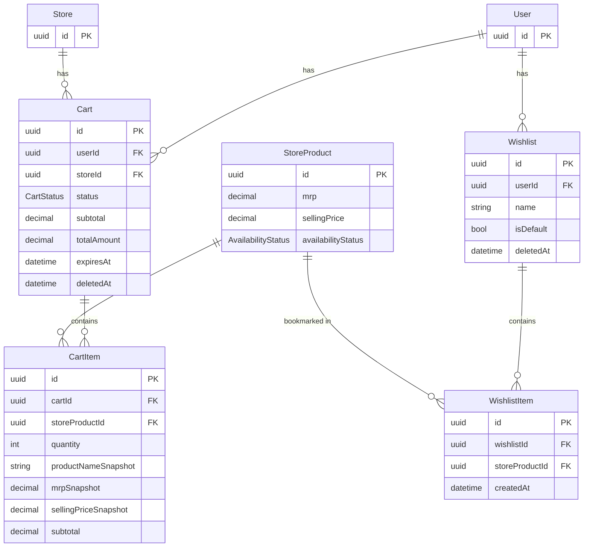

# Database — Module 4: Cart & Wishlist Management

> [← Back to Index](../README.md)
> **Schema file:** [`server/prisma/modules/module4.cart.prisma`](../../server/prisma/modules/module4.cart.prisma)
> **Status:** Schema Complete (4 models)
> **Last Updated:** 2026-07-28

---

## Overview

The Cart & Wishlist module manages the customer-facing shopping experience:

- **Carts** — one active cart per user per store, with full pricing breakdown
- **Cart Items** — line items with product/price snapshots captured at add-to-cart time
- **Wishlists** — named, user-owned bookmark lists with a default list flag
- **Wishlist Items** — bookmarked store products (no price snapshots — live prices at render time)

---

## Enums

> All enums are mapped to snake_case PostgreSQL enum types via `@@map`.

### `CartStatus` → `cart_status`
Lifecycle state of a shopping cart.

| Value | Description |
|---|---|
| `ACTIVE` | Cart is in use — items can be added/removed |
| `CHECKED_OUT` | Cart has been converted to an order |
| `ABANDONED` | Cart was inactive beyond the expiration window |
| `EXPIRED` | Cart expired due to time-to-live policy |

---

## Models

> All models map to snake_case PostgreSQL table names via `@@map`. All camelCase fields map to snake_case column names via `@map`.

### `Cart` → `carts` table

Represents a user's shopping cart scoped to a single store. Each user can have at most one cart per store (enforced by `@@unique([userId, storeId])`).

| Field | DB Column | Type | Constraint | Description |
|---|---|---|---|---|
| `id` | `id` | UUID | PK, auto | Primary key |
| `userId` | `user_id` | UUID | FK → `users.id`, Cascade, Indexed | Cart owner |
| `storeId` | `store_id` | UUID | FK → `stores.id`, Restrict, Indexed | Store this cart belongs to |
| `status` | `status` | `CartStatus` | Default: `ACTIVE`, Indexed | Current cart lifecycle state |
| `subtotal` | `subtotal` | Decimal(10,2) | Default: `0.00` | Sum of all item subtotals |
| `discountAmount` | `discount_amount` | Decimal(10,2) | Default: `0.00` | Applied discount amount |
| `taxAmount` | `tax_amount` | Decimal(10,2) | Default: `0.00` | Calculated GST/tax |
| `deliveryFee` | `delivery_fee` | Decimal(10,2) | Default: `0.00` | Delivery charge |
| `totalAmount` | `total_amount` | Decimal(10,2) | Default: `0.00` | Final amount: `subtotal - discount + tax + delivery` |
| `notes` | `notes` | Text? | Optional | Customer notes for the order |
| `expiresAt` | `expires_at` | Timestamptz(6)? | Optional, Indexed | Cart auto-expiration timestamp |
| `createdBy` | `created_by` | UUID? | Optional | Audit trail |
| `updatedBy` | `updated_by` | UUID? | Optional | Audit trail |
| `createdAt` | `created_at` | Timestamptz(6) | Auto: `now()` | Timestamp |
| `updatedAt` | `updated_at` | Timestamptz(6) | Auto-updated | Timestamp |
| `deletedAt` | `deleted_at` | Timestamptz(6)? | Optional | Soft-delete timestamp |

**Constraints:** `@@unique([userId, storeId])` — one cart per user per store
**Indexes:** `@@index([userId])`, `@@index([storeId])`, `@@index([status])`, `@@index([expiresAt])`, `@@index([userId, status])`, `@@index([storeId, status])`

> **Design Notes:**
> - `couponId` field has been removed from this model — pending a dedicated Coupon/Promotions module
> - Cart status lifecycle: `ACTIVE → CHECKED_OUT` (order placed) | `ACTIVE → ABANDONED` (background job after TTL) | `ACTIVE → EXPIRED` (system cleanup)

---

### `CartItem` → `cart_items` table

A line item in a cart. Price and product data are **snapshotted at add-to-cart time** to preserve the price context even if the store later changes its pricing.

| Field | DB Column | Type | Constraint | Description |
|---|---|---|---|---|
| `id` | `id` | UUID | PK, auto | Primary key |
| `cartId` | `cart_id` | UUID | FK → `carts.id`, Cascade, Indexed | Parent cart |
| `storeProductId` | `store_product_id` | UUID | FK → `store_products.id`, Restrict | Listed product |
| `quantity` | `quantity` | Int | Required | Quantity added |
| `productNameSnapshot` | `product_name_snapshot` | VarChar(200) | Required | Product name at time of add (from `MasterProduct.name`) |
| `unitSnapshot` | `unit_snapshot` | VarChar(50) | Required | Unit description at time of add |
| `mrpSnapshot` | `mrp_snapshot` | Decimal(10,2) | Required | MRP at time of add (from `StoreProduct.mrp`) |
| `sellingPriceSnapshot` | `selling_price_snapshot` | Decimal(10,2) | Required | Selling price at time of add |
| `gstRateSnapshot` | `gst_rate_snapshot` | Decimal(5,2) | Required | GST rate at time of add |
| `subtotal` | `subtotal` | Decimal(10,2) | Required | `quantity × sellingPriceSnapshot` |
| `createdBy` | `created_by` | UUID? | Optional | Audit trail |
| `updatedBy` | `updated_by` | UUID? | Optional | Audit trail |
| `createdAt` | `created_at` | Timestamptz(6) | Auto: `now()` | Timestamp |
| `updatedAt` | `updated_at` | Timestamptz(6) | Auto-updated | Timestamp |

**Constraints:** `@@unique([cartId, storeProductId])` — one line per product per cart
**Indexes:** `@@index([cartId])`, `@@index([cartId, storeProductId])`

> **Snapshot Source Reference:**
>
> | Snapshot Field | Source |
> |---|---|
> | `productNameSnapshot` | `MasterProduct.name` |
> | `unitSnapshot` | `Unit.symbol` + `MasterProduct.unitValue` |
> | `mrpSnapshot` | `StoreProduct.mrp` |
> | `sellingPriceSnapshot` | `StoreProduct.sellingPrice` |
> | `gstRateSnapshot` | `MasterProduct.gstRate` |

---

### `Wishlist` → `wishlists` table

A named bookmark list owned by a user. Users can have multiple wishlists; one is designated as default.

| Field | DB Column | Type | Constraint | Description |
|---|---|---|---|---|
| `id` | `id` | UUID | PK, auto | Primary key |
| `userId` | `user_id` | UUID | FK → `users.id`, Cascade, Indexed | Wishlist owner |
| `name` | `name` | VarChar(100) | Required | Wishlist name (e.g. "Birthday List") |
| `isDefault` | `is_default` | Boolean | Default: `false` | Whether this is the user's default wishlist |
| `createdBy` | `created_by` | UUID? | Optional | Audit trail |
| `updatedBy` | `updated_by` | UUID? | Optional | Audit trail |
| `createdAt` | `created_at` | Timestamptz(6) | Auto: `now()` | Timestamp |
| `updatedAt` | `updated_at` | Timestamptz(6) | Auto-updated | Timestamp |
| `deletedAt` | `deleted_at` | Timestamptz(6)? | Optional | Soft-delete timestamp |

**Constraints:** `@@unique([userId, name])` — unique wishlist name per user
**Indexes:** `@@index([userId])`, `@@index([userId, isDefault])`

---

### `WishlistItem` → `wishlist_items` table

A bookmarked store product in a wishlist. **No price snapshots** — wishlist items show live prices at render time (unlike cart items which snapshot the price).

| Field | DB Column | Type | Constraint | Description |
|---|---|---|---|---|
| `id` | `id` | UUID | PK, auto | Primary key |
| `wishlistId` | `wishlist_id` | UUID | FK → `wishlists.id`, Cascade, Indexed | Parent wishlist |
| `storeProductId` | `store_product_id` | UUID | FK → `store_products.id`, Restrict | Bookmarked store product |
| `createdBy` | `created_by` | UUID? | Optional | Audit trail |
| `createdAt` | `created_at` | Timestamptz(6) | Auto: `now()` | Bookmark timestamp |

**Constraints:** `@@unique([wishlistId, storeProductId])` — no duplicate bookmarks
**Indexes:** `@@index([wishlistId])`

> **Design Note:** `WishlistItem` intentionally has no `updatedAt` or price snapshots. It is a lightweight bookmark — the product details are fetched live at render time. If a product is removed from the store, the wishlist item will show it as unavailable.

---

## Entity Relationship Diagram

---

## Model Summary

| Model | Table | Records Represent |
|---|---|---|
| `Cart` | `carts` | One active cart per user per store |
| `CartItem` | `cart_items` | Line items with price snapshots |
| `Wishlist` | `wishlists` | Named product bookmark lists |
| `WishlistItem` | `wishlist_items` | Lightweight bookmarks (no price snapshots) |
