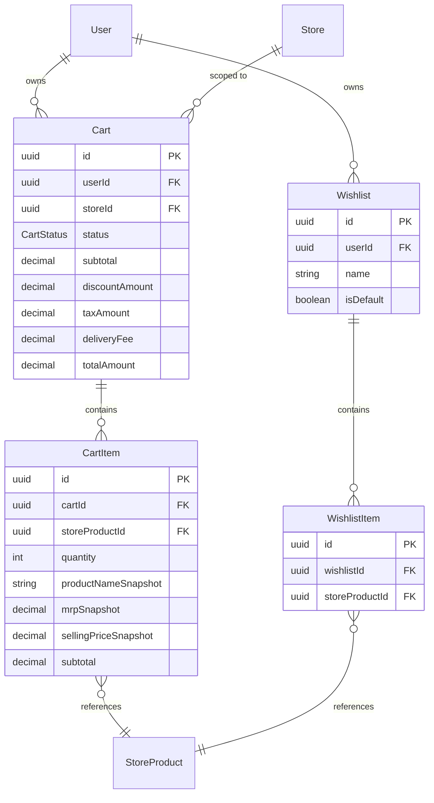

# Database — Module 4: Cart & Wishlist Management

> [← Back to Index](../README.md)  
> **Schema file:** [`server/prisma/modules/module4.cart.prisma`](../../server/prisma/modules/module4.cart.prisma)  
> **Status:** ✅ Schema Complete (4 models)

---

## Overview

The Cart & Wishlist module manages the customer-facing shopping experience:

- **Carts** — one active cart per user per store, with full pricing breakdown
- **Cart Items** — line items with product/price snapshots captured at add-to-cart time
- **Wishlists** — named, user-owned lists with a default list per user
- **Wishlist Items** — bookmarked store products for later purchase

---

## Enums

> All enums are mapped to snake_case PostgreSQL enum types via `@@map`.

### `CartStatus` -> `cart_status`
Lifecycle state of a shopping cart.

| Value | Description |
|---|---|
| `ACTIVE` | Cart is in use — items can be added/removed |
| `CHECKED_OUT` | Cart has been converted to an order |
| `ABANDONED` | Cart was inactive beyond the expiration window |
| `EXPIRED` | Cart expired due to time-to-live policy |

---

## Models

> All models map to snake_case PostgreSQL table names via `@@map`. All camelCase fields map to snake_case column names via `@map`.

### `Cart` -> `carts` table

Represents a user's shopping cart scoped to a single store. Each user can have at most one active cart per store (enforced by `@@unique([userId, storeId])`).

| Field | DB Column | Type | Constraint | Description |
|---|---|---|---|---|
| `id` | `id` | UUID | PK, auto | Primary key |
| `userId` | `user_id` | UUID | FK -> `users.id`, Cascade, Indexed | Cart owner |
| `storeId` | `store_id` | UUID | FK -> `stores.id`, Restrict, Indexed | Store this cart belongs to |
| `status` | `status` | `CartStatus` | Default: `ACTIVE`, Indexed | Current cart lifecycle state |
| `subtotal` | `subtotal` | Decimal(10,2) | Default: `0.00` | Sum of all item subtotals |
| `discountAmount` | `discount_amount` | Decimal(10,2) | Default: `0.00` | Applied discount amount |
| `taxAmount` | `tax_amount` | Decimal(10,2) | Default: `0.00` | Calculated GST / tax |
| `deliveryFee` | `delivery_fee` | Decimal(10,2) | Default: `0.00` | Delivery charge |
| `totalAmount` | `total_amount` | Decimal(10,2) | Default: `0.00` | Final amount: `subtotal - discount + tax + delivery` |
| `notes` | `notes` | Text? | Optional | Customer notes for the order |
| `expiresAt` | `expires_at` | Timestamptz? | Indexed | Cart auto-expiration timestamp |
| `createdBy` | `created_by` | UUID? | Optional | Audit trail |
| `updatedBy` | `updated_by` | UUID? | Optional | Audit trail |
| `createdAt` | `created_at` | Timestamptz | Auto: `now()` | Timestamp |
| `updatedAt` | `updated_at` | Timestamptz | Auto-updated | Timestamp |
| `deletedAt` | `deleted_at` | Timestamptz? | Optional | Soft-delete timestamp |

**Constraints:** `@@unique([userId, storeId])`  
**Indexes:** `@@index([userId])`, `@@index([storeId])`, `@@index([status])`, `@@index([expiresAt])`  
**Relations:**
- `user -> User` (Cascade — deleting a user removes their carts)
- `store -> Store` (Restrict — cannot delete a store with active carts)
- `items -> CartItem[]`

> **Design Note:** The one-cart-per-store constraint (`@@unique([userId, storeId])`) means a user shopping at two different stores has two separate carts. This simplifies checkout flow and delivery fee calculations since each cart maps to exactly one store's delivery zone.

---

### `CartItem` -> `cart_items` table

A line item inside a cart. Captures product name, unit, and pricing snapshots at add-time so the cart remains consistent even if the store updates prices.

| Field | DB Column | Type | Constraint | Description |
|---|---|---|---|---|
| `id` | `id` | UUID | PK, auto | Primary key |
| `cartId` | `cart_id` | UUID | FK -> `carts.id`, Cascade, Indexed | Parent cart |
| `storeProductId` | `store_product_id` | UUID | FK -> `store_products.id`, Restrict, Indexed | The store product being added |
| `quantity` | `quantity` | Int | Required | Quantity of this product |
| `productNameSnapshot` | `product_name_snapshot` | VarChar(200) | Required | Product name at time of add |
| `unitSnapshot` | `unit_snapshot` | VarChar(50) | Required | Unit label at time of add |
| `mrpSnapshot` | `mrp_snapshot` | Decimal(10,2) | Required | MRP at time of add |
| `sellingPriceSnapshot` | `selling_price_snapshot` | Decimal(10,2) | Required | Selling price at time of add |
| `gstRateSnapshot` | `gst_rate_snapshot` | Decimal(5,2) | Required | GST rate at time of add |
| `subtotal` | `subtotal` | Decimal(10,2) | Required | `quantity x sellingPriceSnapshot` |
| `createdBy` | `created_by` | UUID? | Optional | Audit trail |
| `updatedBy` | `updated_by` | UUID? | Optional | Audit trail |
| `createdAt` | `created_at` | Timestamptz | Auto: `now()` | Timestamp |
| `updatedAt` | `updated_at` | Timestamptz | Auto-updated | Timestamp |

**Constraints:** `@@unique([cartId, storeProductId])` — prevents duplicate product entries  
**Indexes:** `@@index([cartId])`, `@@index([storeProductId])`  
**Relations:**
- `cart -> Cart` (Cascade — deleting a cart removes all its items)
- `storeProduct -> StoreProduct` (Restrict — cannot delete a product that is in a cart)

> **Design Note:** Price snapshots (`mrpSnapshot`, `sellingPriceSnapshot`, `gstRateSnapshot`) freeze the pricing at time of add. This prevents cart totals from silently changing when a store updates its prices. The actual `StoreProduct` remains linked via FK for display and re-validation at checkout.

---

### `Wishlist` -> `wishlists` table

A named collection of bookmarked products belonging to a user. Users can create multiple wishlists, with one designated as the default.

| Field | DB Column | Type | Constraint | Description |
|---|---|---|---|---|
| `id` | `id` | UUID | PK, auto | Primary key |
| `userId` | `user_id` | UUID | FK -> `users.id`, Cascade, Indexed | Wishlist owner |
| `name` | `name` | VarChar(100) | Required | Wishlist display name |
| `isDefault` | `is_default` | Boolean | Default: `false`, Indexed | Whether this is the user's default wishlist |
| `createdBy` | `created_by` | UUID? | Optional | Audit trail |
| `updatedBy` | `updated_by` | UUID? | Optional | Audit trail |
| `createdAt` | `created_at` | Timestamptz | Auto: `now()` | Timestamp |
| `updatedAt` | `updated_at` | Timestamptz | Auto-updated | Timestamp |
| `deletedAt` | `deleted_at` | Timestamptz? | Optional | Soft-delete timestamp |

**Constraints:** `@@unique([userId, name])` — no duplicate wishlist names per user  
**Indexes:** `@@index([userId])`, `@@index([isDefault])`  
**Relations:**
- `user -> User` (Cascade — deleting a user removes their wishlists)
- `items -> WishlistItem[]`

---

### `WishlistItem` -> `wishlist_items` table

A single bookmarked store product inside a wishlist. Lightweight — no price snapshots, since wishlists are for saving, not purchasing.

| Field | DB Column | Type | Constraint | Description |
|---|---|---|---|---|
| `id` | `id` | UUID | PK, auto | Primary key |
| `wishlistId` | `wishlist_id` | UUID | FK -> `wishlists.id`, Cascade, Indexed | Parent wishlist |
| `storeProductId` | `store_product_id` | UUID | FK -> `store_products.id`, Restrict, Indexed | The bookmarked product |
| `createdBy` | `created_by` | UUID? | Optional | Audit trail |
| `createdAt` | `created_at` | Timestamptz | Auto: `now()` | Timestamp |

**Constraints:** `@@unique([wishlistId, storeProductId])` — a product can only appear once per wishlist  
**Indexes:** `@@index([wishlistId])`, `@@index([storeProductId])`  
**Relations:**
- `wishlist -> Wishlist` (Cascade — deleting a wishlist removes all its items)
- `storeProduct -> StoreProduct` (Restrict — cannot delete a product that is wishlisted)

> **Design Note:** Unlike `CartItem`, wishlist items do not snapshot prices. Wishlists display live prices from `StoreProduct` at render time, so the user always sees the current price when browsing their saved items.

---

## Updated Relations on Existing Models

The following reverse relations were added to existing models to support Module 4:

| Model | Added Field | Type | Description |
|---|---|---|---|
| `User` | `carts` | `Cart[]` | User's shopping carts |
| `User` | `wishlists` | `Wishlist[]` | User's wishlists |
| `Store` | `carts` | `Cart[]` | Carts belonging to this store |
| `StoreProduct` | `cartItems` | `CartItem[]` | Cart items referencing this product |
| `StoreProduct` | `wishlistItems` | `WishlistItem[]` | Wishlist items referencing this product |

---

## Entity Relationship Diagram



---

## Architecture Notes

### Cart-per-Store Pattern
Each cart is scoped to a single store. If a user adds products from Store A and Store B, they get two separate carts. This:
- Simplifies order creation (one cart -> one order -> one store)
- Keeps delivery fee calculation per-store
- Avoids cross-store checkout complexity

### Price Snapshot Strategy
`CartItem` captures `mrpSnapshot`, `sellingPriceSnapshot`, and `gstRateSnapshot` at add time. This ensures:
- Cart totals are stable regardless of store price updates
- Checkout validation can compare snapshots against live prices to warn about changes
- Historical accuracy for abandoned cart analytics

### Wishlist Design
Wishlists are lightweight — no snapshots, no pricing logic. They simply bookmark `StoreProduct` references. Live prices are fetched at render time. The `isDefault` flag allows one-tap "Save for Later" functionality without requiring the user to pick a wishlist.

---

## Model Summary

| Model | Table | Records Represent |
|---|---|---|
| `Cart` | `carts` | Active shopping carts (per user per store) |
| `CartItem` | `cart_items` | Line items with pricing snapshots |
| `Wishlist` | `wishlists` | Named product bookmark lists |
| `WishlistItem` | `wishlist_items` | Individual bookmarked store products |

---

## Recommended Post-Migration SQL Enhancements

The following PostgreSQL database constraint is to be applied via a raw SQL migration script after initial Prisma schema generation:

### 1. CartItem Quantity CHECK Constraint
Prevents invalid zero or negative quantities in cart line items directly at the database engine layer:
```sql
ALTER TABLE cart_items
  ADD CONSTRAINT chk_cart_items_quantity_positive CHECK (quantity > 0);
```

