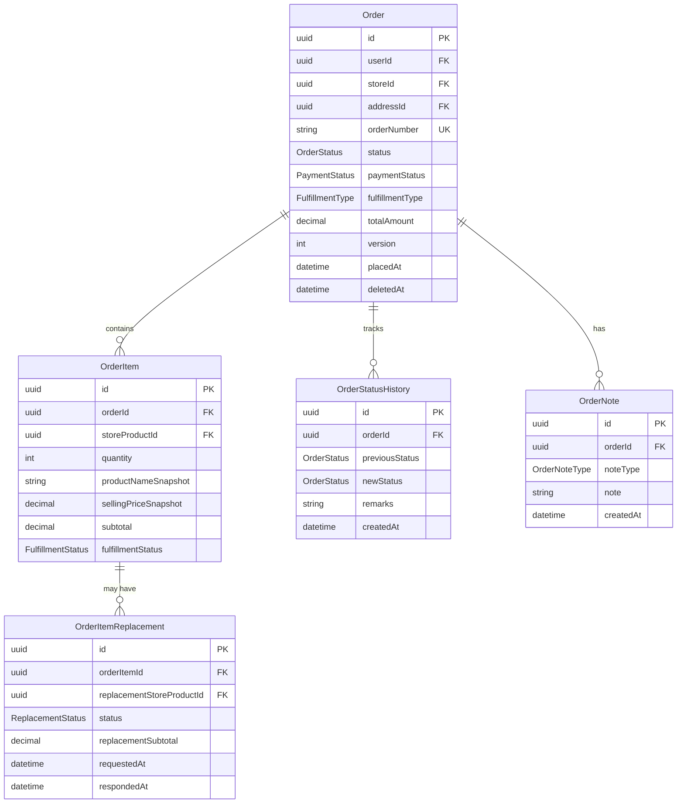

# Database — Module 5: Order Management

> [← Back to Index](../README.md)
> **Schema file:** [`server/prisma/modules/module5.order.prisma`](../../server/prisma/modules/module5.order.prisma)
> **Status:** Schema Complete (5 models)
> **Last Updated:** 2026-07-28

---

## Overview

The Order Management module handles the full order lifecycle from placement through delivery:

- **Orders** — per-store order records with full delivery address snapshots and pricing breakdowns
- **Order Items** — line items with product/price snapshots and per-item fulfillment tracking
- **Order Item Replacements** — merchant-initiated product substitution workflow with customer approval
- **Order Status History** — immutable audit trail of every status transition
- **Order Notes** — multi-party notes from customers, merchants, system, and delivery partners

---

## Enums

> All enums are mapped to snake_case PostgreSQL enum types via `@@map`.

### `OrderStatus` -> `order_status`
Lifecycle state of an order.

| Value | Description |
|---|---|
| `PENDING` | Order placed, awaiting confirmation |
| `CONFIRMED` | Store has accepted the order |
| `PREPARING` | Store is preparing the order |
| `READY_FOR_PICKUP` | Order is packed and ready |
| `OUT_FOR_DELIVERY` | Order handed to delivery partner |
| `DELIVERED` | Order successfully delivered |
| `CANCELLED` | Order was cancelled |
| `FAILED` | Order failed (payment failure, etc.) |

---

### `FulfillmentType` -> `fulfillment_type`
How the order will be fulfilled.

| Value | Description |
|---|---|
| `DELIVERY` | Home delivery to customer address |
| `PICKUP` | Customer picks up from store |

---

### `FulfillmentStatus` -> `fulfillment_status`
Per-item fulfillment state within an order.

| Value | Description |
|---|---|
| `PENDING` | Item not yet processed |
| `CONFIRMED` | Item confirmed available |
| `REPLACED` | Item replaced with a substitute |
| `CANCELLED` | Item cancelled from the order |
| `DELIVERED` | Item delivered to customer |

---

### `ReplacementStatus` -> `replacement_status`
State of a product replacement request.

| Value | Description |
|---|---|
| `PENDING` | Replacement proposed, awaiting customer response |
| `ACCEPTED` | Customer accepted the replacement |
| `REJECTED` | Customer rejected the replacement |
| `CANCELLED` | Replacement request withdrawn |

---

### `OrderNoteType` -> `order_note_type`
Author type for order notes.

| Value | Description |
|---|---|
| `CUSTOMER` | Note from the customer |
| `MERCHANT` | Note from the store owner |
| `SYSTEM` | Auto-generated system note |
| `DELIVERY_PARTNER` | Note from the delivery agent |

---

## Models

> All models map to snake_case PostgreSQL table names via `@@map`. All camelCase fields map to snake_case column names via `@map`.

### `Order` -> `orders` table

Represents a placed order scoped to a single store. Contains a full delivery address snapshot frozen at order time, pricing breakdown, and lifecycle timestamps.

| Field | DB Column | Type | Constraint | Description |
|---|---|---|---|---|
| `id` | `id` | UUID | PK, auto | Primary key |
| `userId` | `user_id` | UUID | FK -> `users.id`, Restrict, Indexed | Customer who placed the order |
| `storeId` | `store_id` | UUID | FK -> `stores.id`, Restrict, Indexed | Store fulfilling the order |
| `addressId` | `address_id` | UUID | FK -> `addresses.id`, Restrict | Reference to original address record |
| `orderNumber` | `order_number` | VarChar(50) | Unique | Human-readable order identifier |
| `status` | `status` | `OrderStatus` | Default: `PENDING`, Indexed | Current order lifecycle state |
| `paymentStatus` | `payment_status` | `PaymentStatus` | Default: `PENDING`, Indexed | Payment state (from Module 6 enum) |
| `fulfillmentType` | `fulfillment_type` | `FulfillmentType` | Default: `DELIVERY` | How the order will be fulfilled |
| `subtotal` | `subtotal` | Decimal(10,2) | Default: `0.00` | Sum of all item subtotals |
| `discountAmount` | `discount_amount` | Decimal(10,2) | Default: `0.00` | Applied discount |
| `taxAmount` | `tax_amount` | Decimal(10,2) | Default: `0.00` | Total GST applied |
| `deliveryFee` | `delivery_fee` | Decimal(10,2) | Default: `0.00` | Delivery charge |
| `totalAmount` | `total_amount` | Decimal(10,2) | Default: `0.00` | Final payable amount |
| `deliveryReceiverName` | `delivery_receiver_name` | VarChar(100) | Required | Snapshot: recipient name |
| `deliveryPhone` | `delivery_phone` | VarChar(20) | Required | Snapshot: contact phone |
| `deliveryEmail` | `delivery_email` | VarChar(255)? | Optional | Snapshot: contact email |
| `deliveryHouseNo` | `delivery_house_no` | VarChar(100) | Required | Snapshot: house/flat number |
| `deliveryStreet` | `delivery_street` | VarChar(255) | Required | Snapshot: street |
| `deliveryArea` | `delivery_area` | VarChar(255) | Required | Snapshot: area |
| `deliveryLandmark` | `delivery_landmark` | VarChar(255)? | Optional | Snapshot: landmark |
| `deliveryCity` | `delivery_city` | VarChar(100) | Required | Snapshot: city |
| `deliveryState` | `delivery_state` | VarChar(100) | Required | Snapshot: state |
| `deliveryCountry` | `delivery_country` | VarChar(100) | Required | Snapshot: country |
| `deliveryPincode` | `delivery_pincode` | VarChar(20) | Required | Snapshot: pincode |
| `deliveryLatitude` | `delivery_latitude` | Decimal(10,7)? | Optional | Snapshot: GPS latitude |
| `deliveryLongitude` | `delivery_longitude` | Decimal(10,7)? | Optional | Snapshot: GPS longitude |
| `deliveryInstructions` | `delivery_instructions` | Text? | Optional | Customer delivery instructions |
| `placedAt` | `placed_at` | Timestamptz | Auto: `now()`, Indexed | When order was placed |
| `version` | `version` | Int | Default: `0` | Version counter for optimistic locking |
| `confirmedAt` | `confirmed_at` | Timestamptz? | Optional | When store confirmed the order |
| `packedAt` | `packed_at` | Timestamptz? | Optional | When order was packed |
| `outForDeliveryAt` | `out_for_delivery_at` | Timestamptz? | Optional | When handed to delivery partner |
| `deliveredAt` | `delivered_at` | Timestamptz? | Optional | When order was delivered |
| `cancelledAt` | `cancelled_at` | Timestamptz? | Optional | When order was cancelled |
| `createdBy` | `created_by` | UUID? | Optional | Audit trail |
| `updatedBy` | `updated_by` | UUID? | Optional | Audit trail |
| `createdAt` | `created_at` | Timestamptz | Auto: `now()` | Timestamp |
| `updatedAt` | `updated_at` | Timestamptz | Auto-updated | Timestamp |
| `deletedAt` | `deleted_at` | Timestamptz? | Optional | Soft-delete timestamp |

**Indexes:** `@@index([userId])`, `@@index([storeId])`, `@@index([status])`, `@@index([paymentStatus])`, `@@index([placedAt])`, `@@index([userId, status])`, `@@index([storeId, status])`, `@@index([userId, placedAt])`
**Relations:**
- `user -> User`
- `store -> Store`
- `address -> Address`
- `items -> OrderItem[]`
- `statusHistory -> OrderStatusHistory[]`
- `notes -> OrderNote[]`

> **Design Notes:**
> - All `delivery*` fields are snapshots — they freeze the address at order time. The `addressId` FK keeps a reference to the original `Address` record for auditing but is not used for display.
> - `version` enables **Optimistic Concurrency Control**: state transitions and updates run `WHERE id = ... AND version = currentVersion`, incrementing `version`. Prevents race conditions during concurrent status changes or cancellations.
> - **Payment Status Synchronization Rule:** Both `Order.paymentStatus` and `Payment.paymentStatus` exist. To maintain consistency, any update to payment status must update `Payment` first, then `Order` within the exact same database transaction (`$transaction`).
> - Timeline fields (`confirmedAt`, `packedAt`, etc.) provide granular SLA tracking.

---

### `OrderItem` -> `order_items` table

A single product line within an order. Pricing and product details are snapshotted from the `StoreProduct` and `MasterProduct` at the moment of order placement.

| Field | DB Column | Type | Constraint | Description |
|---|---|---|---|---|
| `id` | `id` | UUID | PK, auto | Primary key |
| `orderId` | `order_id` | UUID | FK -> `orders.id`, Cascade, Indexed | Parent order |
| `storeProductId` | `store_product_id` | UUID | FK -> `store_products.id`, Restrict, Indexed | The listed product |
| `quantity` | `quantity` | Int | Required | Quantity ordered |
| `productNameSnapshot` | `product_name_snapshot` | VarChar(200) | Required | Product name at order time |
| `unitSnapshot` | `unit_snapshot` | VarChar(50) | Required | Unit label at order time |
| `mrpSnapshot` | `mrp_snapshot` | Decimal(10,2) | Required | MRP at order time |
| `sellingPriceSnapshot` | `selling_price_snapshot` | Decimal(10,2) | Required | Selling price at order time |
| `gstRateSnapshot` | `gst_rate_snapshot` | Decimal(5,2) | Required | GST rate at order time |
| `subtotal` | `subtotal` | Decimal(10,2) | Required | `quantity x sellingPriceSnapshot` |
| `fulfillmentStatus` | `fulfillment_status` | `FulfillmentStatus` | Default: `PENDING`, Indexed | Per-item fulfillment state |
| `createdBy` | `created_by` | UUID? | Optional | Audit trail |
| `updatedBy` | `updated_by` | UUID? | Optional | Audit trail |
| `createdAt` | `created_at` | Timestamptz | Auto: `now()` | Timestamp |
| `updatedAt` | `updated_at` | Timestamptz | Auto-updated | Timestamp |

**Indexes:** `@@index([orderId])`, `@@index([storeProductId])`, `@@index([orderId, fulfillmentStatus])`
**Relations:**
- `order -> Order` (Cascade)
- `storeProduct -> StoreProduct` (Restrict)
- `replacements -> OrderItemReplacement[]`

---

### `OrderItemReplacement` -> `order_item_replacements` table

Represents a merchant-proposed product substitution for a single order item. The customer must approve or reject the replacement.

| Field | DB Column | Type | Constraint | Description |
|---|---|---|---|---|
| `id` | `id` | UUID | PK, auto | Primary key |
| `orderItemId` | `order_item_id` | UUID | FK -> `order_items.id`, Cascade, Indexed | The original item being replaced |
| `replacementStoreProductId` | `replacement_store_product_id` | UUID | FK -> `store_products.id`, Restrict, Indexed | The proposed substitute product |
| `status` | `status` | `ReplacementStatus` | Default: `PENDING`, Indexed | Current state of the replacement |
| `replacementProductNameSnapshot` | `replacement_product_name_snapshot` | VarChar(200) | Required | Substitute product name snapshot |
| `replacementUnitSnapshot` | `replacement_unit_snapshot` | VarChar(50) | Required | Substitute unit snapshot |
| `replacementMrpSnapshot` | `replacement_mrp_snapshot` | Decimal(10,2) | Required | Substitute MRP snapshot |
| `replacementSellingPriceSnapshot` | `replacement_selling_price_snapshot` | Decimal(10,2) | Required | Substitute selling price snapshot |
| `replacementGstRateSnapshot` | `replacement_gst_rate_snapshot` | Decimal(5,2) | Required | Substitute GST rate snapshot |
| `replacementSubtotal` | `replacement_subtotal` | Decimal(10,2) | Required | Substitute subtotal |
| `merchantReason` | `merchant_reason` | Text? | Optional | Why the merchant is replacing |
| `customerResponse` | `customer_response` | Text? | Optional | Customer's reply or note |
| `requestedAt` | `requested_at` | Timestamptz | Auto: `now()` | When replacement was proposed |
| `respondedAt` | `responded_at` | Timestamptz? | Optional | When customer responded |
| `createdBy` | `created_by` | UUID? | Optional | Audit trail |
| `updatedBy` | `updated_by` | UUID? | Optional | Audit trail |
| `createdAt` | `created_at` | Timestamptz | Auto: `now()` | Timestamp |
| `updatedAt` | `updated_at` | Timestamptz | Auto-updated | Timestamp |

**Indexes:** `@@index([orderItemId])`, `@@index([replacementStoreProductId])`, `@@index([status])`
**Relations:**
- `orderItem -> OrderItem` (Cascade)
- `replacementStoreProduct -> StoreProduct` (Restrict)

---

### `OrderStatusHistory` -> `order_status_history` table

An immutable audit log of every order status transition. Records are written once on each status change and never modified.

| Field | DB Column | Type | Constraint | Description |
|---|---|---|---|---|
| `id` | `id` | UUID | PK, auto | Primary key |
| `orderId` | `order_id` | UUID | FK -> `orders.id`, Cascade, Indexed | Parent order |
| `previousStatus` | `previous_status` | `OrderStatus`? | Optional | State before the transition (`null` for first entry) |
| `newStatus` | `new_status` | `OrderStatus` | Required, Indexed | State after the transition |
| `remarks` | `remarks` | Text? | Optional | Free-text explanation for the transition |
| `createdBy` | `created_by` | UUID? | Optional | Who triggered the transition |
| `createdAt` | `created_at` | Timestamptz | Auto: `now()`, Indexed | When the transition occurred |

**Indexes:** `@@index([orderId])`, `@@index([orderId, createdAt])`
**Relations:** `order -> Order` (Cascade)

> **Design Note:** Write-once record. No `updatedAt` or `updatedBy` fields by design.

---

### `OrderNote` -> `order_notes` table

Multi-party notes attached to an order. Supports notes from customers, merchants, system events, and delivery partners.

| Field | DB Column | Type | Constraint | Description |
|---|---|---|---|---|
| `id` | `id` | UUID | PK, auto | Primary key |
| `orderId` | `order_id` | UUID | FK -> `orders.id`, Cascade, Indexed | Parent order |
| `noteType` | `note_type` | `OrderNoteType` | Required, Indexed | Who authored the note |
| `note` | `note` | Text | Required | Note content |
| `createdBy` | `created_by` | UUID? | Optional | Author user ID |
| `createdAt` | `created_at` | Timestamptz | Auto: `now()`, Indexed | When note was added |

**Indexes:** `@@index([orderId])`, `@@index([orderId, createdAt])`
**Relations:** `order -> Order` (Cascade)

---

## Entity Relationship Diagram



---

## Order Lifecycle

```
PENDING
 |
 +--> CONFIRMED (merchant accepts)
 | |
 | +--> PREPARING
 | |
 | +--> READY_FOR_PICKUP
 | |
 | +-----------+
 | |
 | OUT_FOR_DELIVERY
 | |
 | DELIVERED
 |
 +--> CANCELLED (by customer or merchant)
 |
 +--> FAILED (payment failure)
```

Each transition writes a record to `OrderStatusHistory`.

---

## Model Summary

| Model | Table | Records Represent |
|---|---|---|
| `Order` | `orders` | Placed orders with address + pricing snapshot |
| `OrderItem` | `order_items` | Per-item product + pricing snapshot |
| `OrderItemReplacement` | `order_item_replacements` | Merchant-proposed product substitutions |
| `OrderStatusHistory` | `order_status_history` | Immutable status transition log |
| `OrderNote` | `order_notes` | Multi-party order communication notes |

---

## Recommended Post-Migration SQL Enhancements

The following PostgreSQL database constraint is to be applied via a raw SQL migration script after initial Prisma schema generation:

### 1. OrderItem Quantity CHECK Constraint
Prevents invalid zero or negative quantities in order line items directly at the database engine layer:
```sql
ALTER TABLE order_items
 ADD CONSTRAINT chk_order_items_quantity_positive CHECK (quantity > 0);
```

