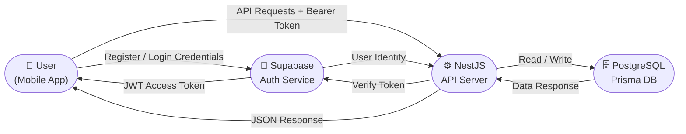
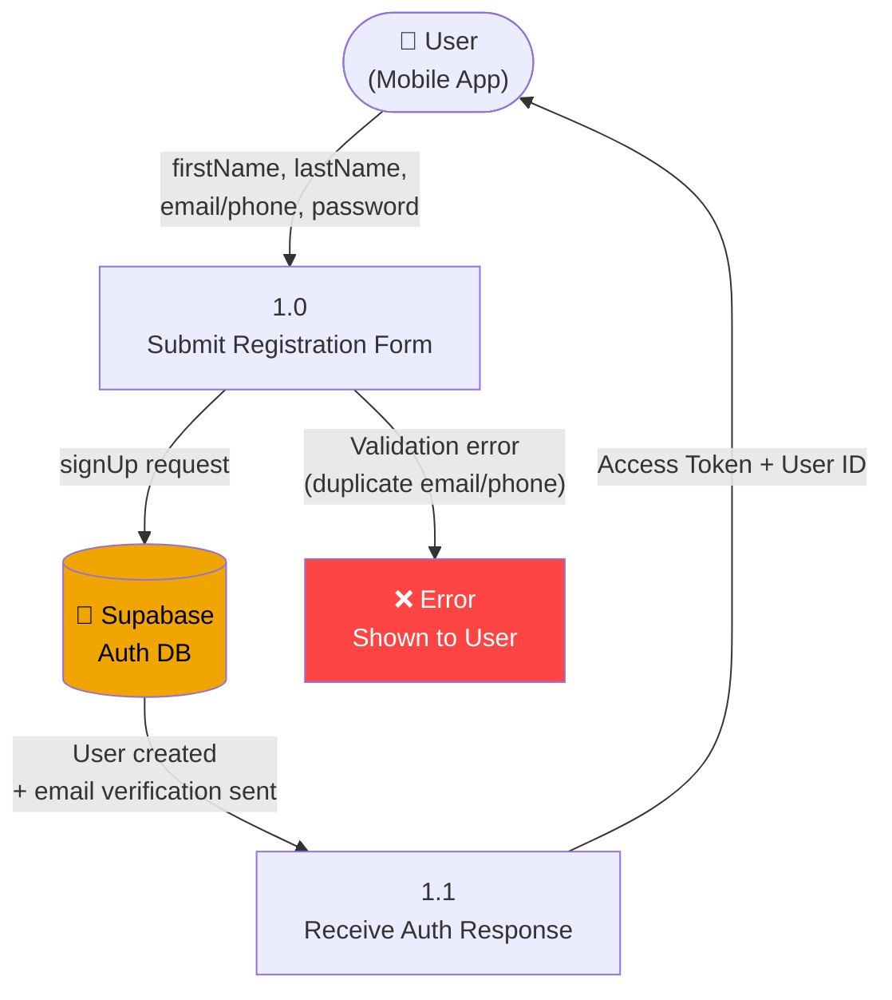
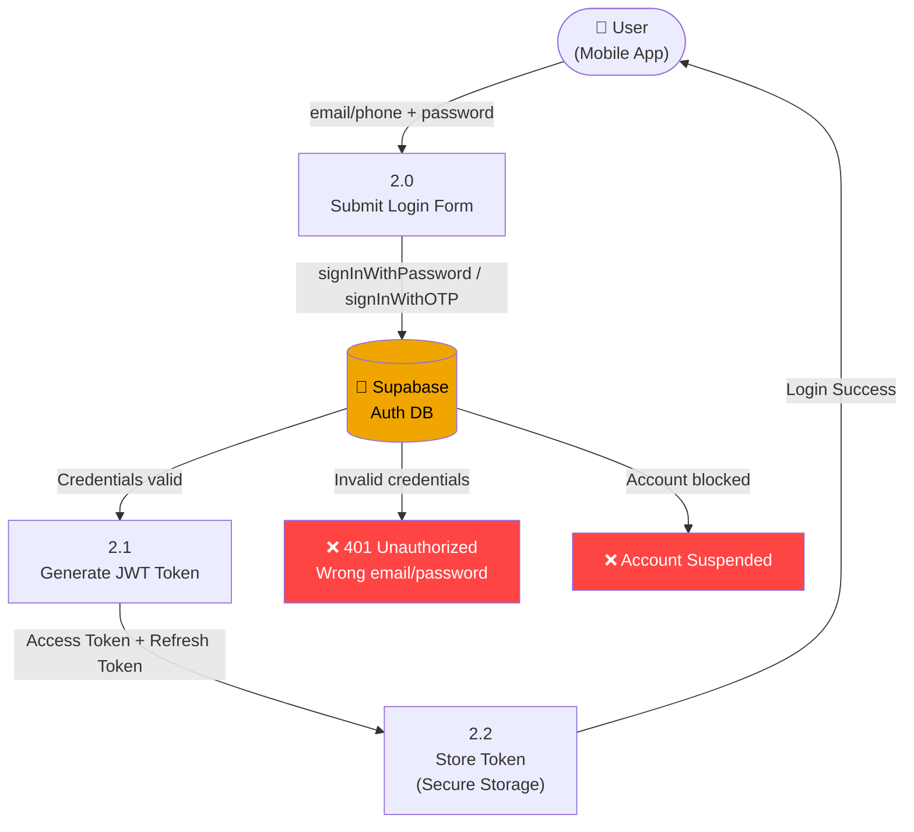
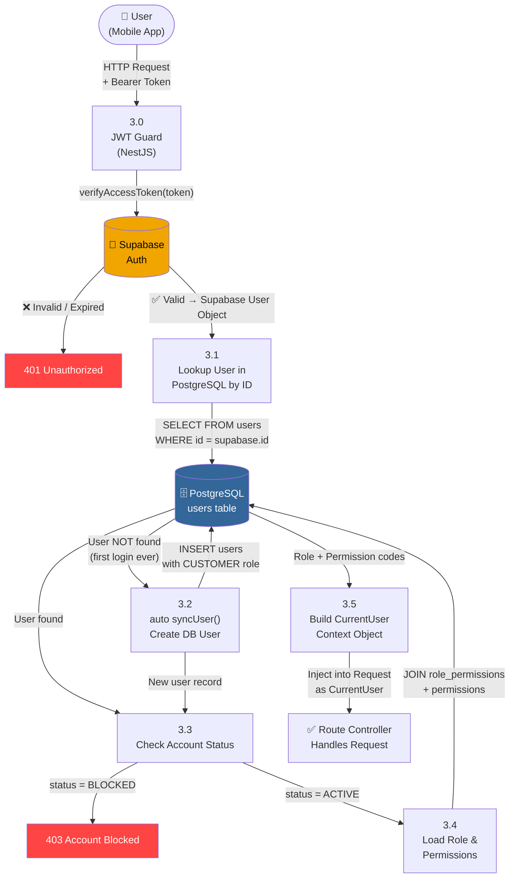
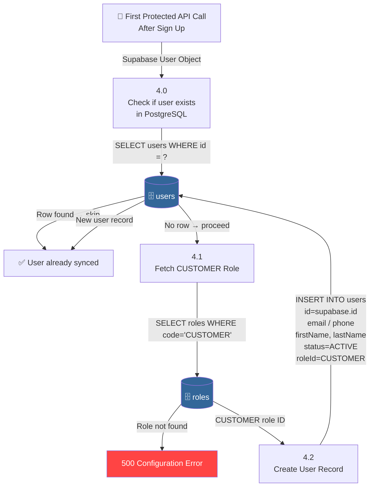
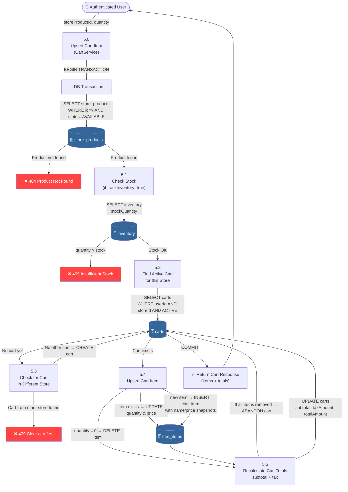
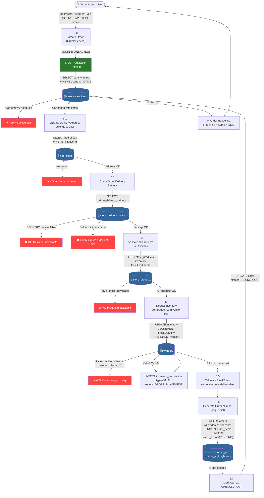
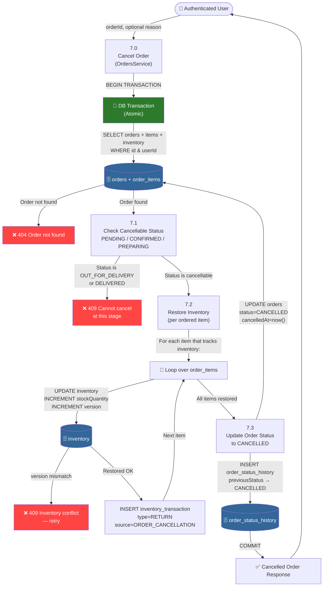

# 📊 Data Flow Diagrams — aasPass System

> **System Stack:** React Native (Expo) → NestJS API → Supabase Auth + PostgreSQL (Prisma)

---

## 📋 What's Covered & What's Left

### ✅ Covered (Your Requested Flows)
| # | Flow | Notes |
|---|------|-------|
| 1 | **Sign Up** | Supabase creates user in Auth DB |
| 2 | **Sign In** | Supabase issues JWT access token |
| 3 | **Authentication / Token Verification** | NestJS guard verifies JWT on every API call |
| 4 | **User Registration (Auto-Sync)** | Auto-creates DB user on first authenticated request |
| 5 | **Add to Cart** | Validates stock, creates/updates cart & cart items |
| 6 | **Place Order** | Cart → Order with inventory deduction (atomic transaction) |
| 7 | **Order Cancellation** | Cancels order & restores inventory |

### ⚠️ Additional Flows Identified (Not Yet Requested)
| # | Flow | Why It Matters |
|---|------|----------------|
| 8 | **Wishlist Add/Remove** | Module exists in schema & server |
| 9 | **OTP Verification** | `BusinessOTP` model exists for order delivery/pickup |
| 10 | **Logout / Session Revocation** | `UserSession` model with revocation reasons |
| 11 | **Store Browse / Product Search** | Catalog module present |
| 12 | **Payment Processing** | `payments` module & `PaymentStatus` on Order |

> Let me know if you want DFDs for any of the above!

---

## 🔑 DFD Notation

```
[ External Entity ]   → Actor outside the system (User, Supabase)
( Process )           → System action / business logic
=[ Data Store ]=      → Database table or service
→ Arrow               → Data flow direction
```

---

## Level 0 — Context Diagram (Entire System)



---

## 1️⃣ Sign Up Flow

> **Who does it:** User enters name, email/phone, password in the mobile app.  
> **Where it goes:** Directly to Supabase — the NestJS backend is NOT involved.  
> **Result:** Supabase creates the auth user; your PostgreSQL user is NOT created yet (that happens on first sign-in via auto-sync).



**Data Stored:**
- `supabase.auth.users` → `id`, `email`, `phone`, `user_metadata.first_name`, `user_metadata.last_name`

---

## 2️⃣ Sign In Flow

> **Who does it:** Returning user enters email/phone + password.  
> **Where it goes:** Supabase validates credentials and issues JWT.  
> **Result:** Mobile app stores the access token for future API calls.



**Data Read:**
- `supabase.auth.users` → validates password hash, account status

**Data Returned:**
- `access_token` (JWT, short-lived ~1hr)
- `refresh_token` (long-lived, stored by Expo app)

---

## 3️⃣ Authentication / Token Verification Flow

> **Every protected API call goes through this.**  
> **How it works:** NestJS has a JWT Guard that intercepts all requests, verifies the token with Supabase, then either auto-syncs a new user OR loads the existing user from PostgreSQL with roles and permissions.



**Data Read:**
- `supabase.auth` → verify JWT signature
- `users` → lookup by Supabase UUID
- `roles` + `role_permissions` + `permissions` → load access rights

**Data Written (only on first-ever login):**
- `users` → INSERT with `id`, `email`, `phone`, `firstName`, `lastName`, `roleId=CUSTOMER`, `status=ACTIVE`

---

## 4️⃣ User Registration (Auto-Sync) Detail

> This is a **sub-process** of Authentication (Step 3.2). Shown separately for clarity.  
> It fires **once** — on the very first authenticated request after Sign Up.



**Key Business Rule:** The Supabase UUID becomes the PostgreSQL primary key — they're always in sync.

---

## 5️⃣ Add to Cart Flow

> **User selects a product and taps "Add to Cart".**  
> **One cart per user per store** — if user already has a cart from Store A and adds from Store B, it's blocked.



**Data Written:**
- `carts` → created or updated (subtotal, taxAmount, totalAmount)
- `cart_items` → upserted with price snapshots from current store product

**Key Business Rule:** Price snapshots are taken at add-to-cart time, not at checkout.

---

## 6️⃣ Place Order Flow

> **User reviews cart and taps "Place Order".**  
> **Everything is atomic** — if stock check fails midway, the whole order is rolled back.



**Data Written (all in one atomic transaction):**
- `orders` → new record with address snapshot, totals, `status=PENDING`
- `order_items` → one row per cart item (price snapshots copied)
- `order_status_history` → first entry: `PENDING`
- `inventory` → stock decremented + version incremented (optimistic lock)
- `inventory_transactions` → SALE transaction per product
- `carts` → status updated to `CHECKED_OUT`

---

## 7️⃣ Order Cancellation Flow

> **User taps "Cancel Order"** from order details screen.  
> **Only cancellable from:** `PENDING`, `CONFIRMED`, `PREPARING` statuses.  
> **Inventory is restored atomically** — no stock is lost.



**Data Updated (all atomic):**
- `orders` → `status=CANCELLED`, `cancelledAt=now()`
- `order_status_history` → new entry with previous → CANCELLED
- `inventory` → `stockQuantity` restored per item
- `inventory_transactions` → RETURN transaction per product

---

## 🗂️ Summary Table — Data Stores Involved

| Flow | Tables Touched |
|------|---------------|
| Sign Up | `supabase.auth.users` |
| Sign In | `supabase.auth.users` |
| Auth Verify | `users`, `roles`, `role_permissions`, `permissions` |
| User Sync | `users`, `roles` |
| Add to Cart | `store_products`, `inventory`, `carts`, `cart_items` |
| Place Order | `carts`, `cart_items`, `addresses`, `store_delivery_settings`, `store_products`, `inventory`, `inventory_transactions`, `orders`, `order_items`, `order_status_history` |
| Cancel Order | `orders`, `order_items`, `inventory`, `inventory_transactions`, `order_status_history` |

---

## 🏗️ How I Created These DFDs

1. **Explored your codebase** — read `schema.prisma`, `auth.service.ts`, `cart.service.ts`, `orders.service.ts`
2. **Traced real code paths** — every arrow in these diagrams maps to actual code lines
3. **Identified all data stores** — matched Prisma models to DFD data stores
4. **Captured error paths** — included all `throw` statements from services
5. **Noted atomic transactions** — highlighted `$transaction()` blocks in green
